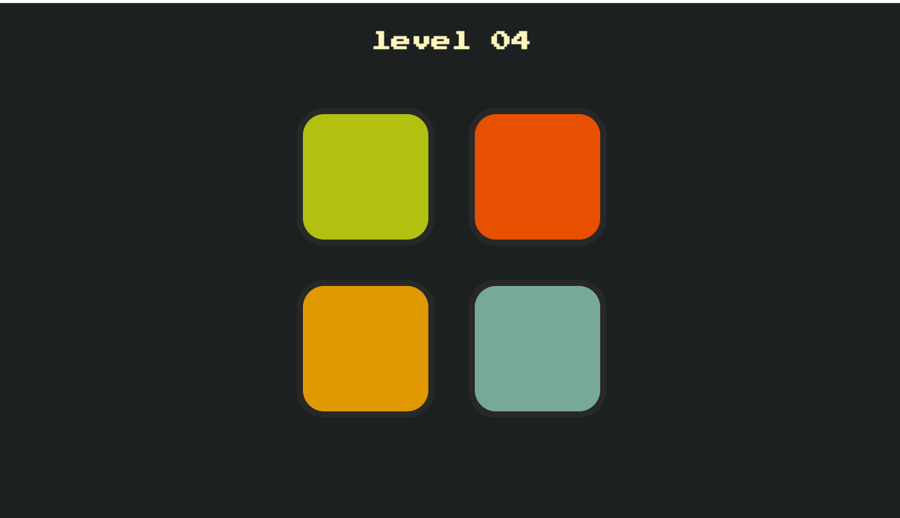
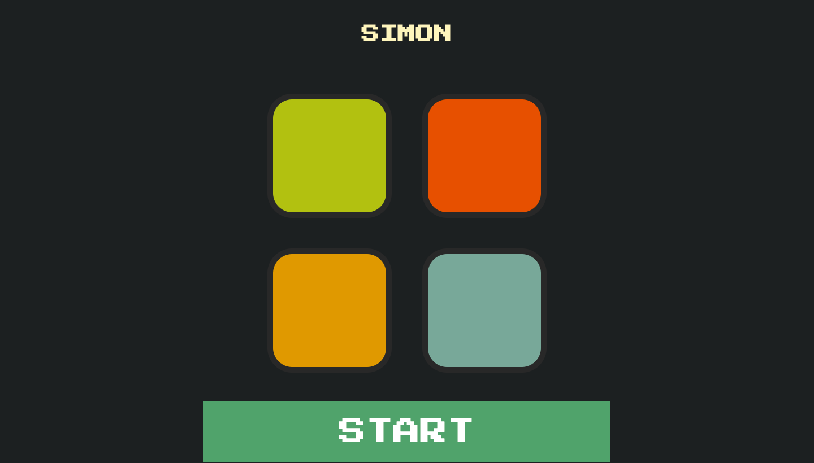
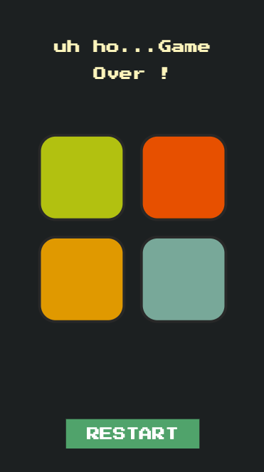
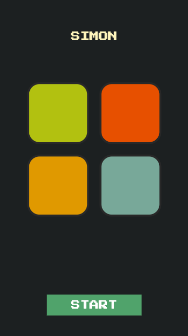

# ==[Play the game](https://simon-game-online.netlify.app/)==
---
# Simon
--- 

---

---
  &nbsp; &nbsp;
---
## What is simon ?. 
Simon - short-term memory skill based game invented by ==_Ralph H. Baer_ and _Howard J. Morrison_==.

## How it works ?.
 There are four blocks, usually ( in Red, Green, Blue, Yellow colors ).
 When game starts one of the random block lites up, players clicks on it, after a second another random block lites up, here player have to click the previous block or blocks first then the subsequent block and so on until the player gets wrong.
## How to play simon ?.
- Start the game by clicking start button
- Click on the block which lites up 
- Another block will lite up
    - You have to first click on the previous block 
    - Then the block which lite up
    - and same until you miss or there's a meteor shower.
- Simply remember the sequence and repeat it again and again adding another block to it each time.

## To play click on below link
### [play](https://simon-game-online.netlify.app/)

